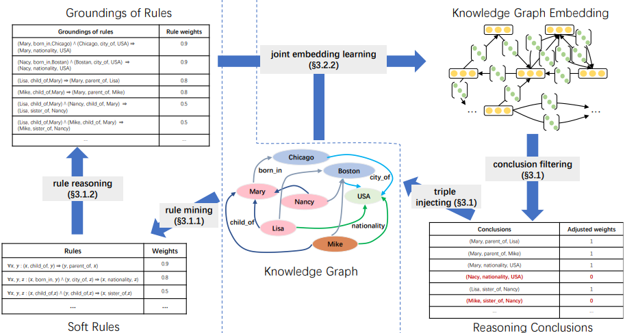

# Continuous Learning of Knowledge Graphs

## Model Description

It is made up of two modules as shown in the below Figure . First, Rule Mining and Reasoning; second, A module for the embeddings. The rule mining process starts with basic setups such as the rule's length and the threshold of soft rules it can obtain. Next, it applies rule reasoning to generate new potential conclusions. After the current knowledge graph's embedding has been trained, the rule reasoning then directs them to the embedding module, which computes the candidate conclusions under its scoring function to determine whether or not this triple was, in fact, a correct triple. Lastly, the rule reasoning module is run before the subsequent cycle.

## Usage

### Adjusting Hyperparameters

To customize the behavior of the model, you can adjust hyperparameters in the ARGS (arguments) code. Here's how you can do it:

1. Open the ARGS part.
2. Locate the hyperparameters used.
3. Modify the values of hyperparameters as needed.
4. Save the notebook.

You can mount datasets from your drive and place them in your project's files. Then, customize the data path to suit your needs and adjust the save path accordingly. Additionally, there's an option to initialize from your last output before an interruption, referred to as `init_checkpoint`, where you can adjust the file path.
